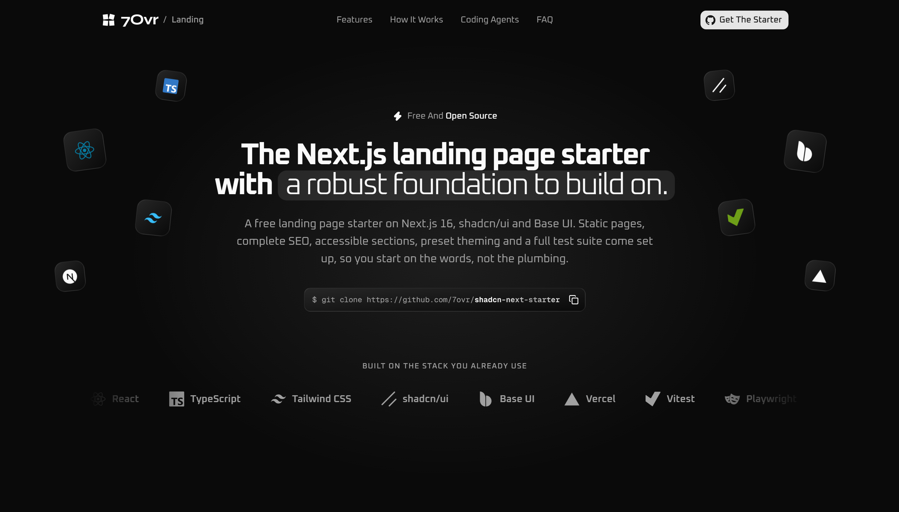

<div align="center">

<picture>
  <source media="(prefers-color-scheme: dark)" srcset=".github/assets/logo-dark.svg" />
  
</picture>

<h1>7Ovr Landing Starter</h1>

<p><strong>A Next.js landing page starter with a robust foundation to build on.</strong><br />
Static pages, complete SEO, accessible sections and one-command theming on shadcn/ui and Base UI, optimized for coding agents.</p>

<p>
  <a href="https://github.com/7ovr/shadcn-next-starter/actions/workflows/ci.yml"></a>
  <a href="LICENSE"></a>
  
  
  
  
  
</p>

<p>
  <a href="#quick-start"><strong>Quick Start</strong></a> ·
  <a href="#whats-inside"><strong>What's Inside</strong></a> ·
  <a href="#seo"><strong>SEO</strong></a> ·
  <a href="#working-with-coding-agents"><strong>Coding Agents</strong></a> ·
  <a href="#add-blocks-from-7ovr"><strong>Add Blocks</strong></a>
</p>

</div>

<br />



## Why this starter

Most landing page templates look finished and stop there. This one also ships the parts that decide whether a landing page gets found and keeps working.

- **Static and fast.** Every route is prerendered at build time, and a Request-time API anywhere fails the build rather than the crawl.
- **SEO already done.** Titles, descriptions, canonicals, Open Graph and Twitter cards, a generated share image, JSON-LD, `robots.txt` and a sitemap, all from one config file. Preview deploys stay out of search.
- **Readable without JavaScript.** Every section and every FAQ answer is in the HTML, with one h1 per page, a skip link and motion that respects reduced motion.
- **One preset restyles it all.** Every colour, radius and font comes from shadcn's theme tokens, so `shadcn apply` restyles the whole site.
- **Every word in one place.** The copy lives in typed files under `src/content/`, one per section.
- **Optimized for coding agents.** `AGENTS.md` holds every convention, `CLAUDE.md` imports it, and four vendored skills keep Claude Code, Codex and Cursor on pattern.
- **Checked on every commit.** Oxlint with [`@shadcn/lint`](https://github.com/shadcn-ui/lint), oxfmt, TypeScript 7, Vitest and a production build run in CI; Lefthook formats and lints staged files locally.

The landing page and its SEO are in. The blog, the legal pages and the end-to-end checks arrive in the next pull requests.

## Quick start

You need Node 24 or newer and [pnpm](https://pnpm.io) 12 or newer.

```bash
git clone https://github.com/7ovr/shadcn-next-starter
cd shadcn-next-starter
pnpm install
pnpm dev
```

Open http://localhost:3000. Installing also sets up the Git hooks that format and lint your changes on commit. To start a repository of your own instead, use [Use This Template](https://github.com/7ovr/shadcn-next-starter/generate) on GitHub.

## What's inside

| Layer     | Choice                                                          |
| --------- | --------------------------------------------------------------- |
| Framework | Next.js 16 with the App Router, every route prerendered         |
| UI        | React 19, shadcn/ui (`base-nova` style) on Base UI              |
| Styling   | Tailwind CSS v4 with light and dark theme tokens                |
| Language  | TypeScript 7 in strict mode                                     |
| SEO       | Metadata, share image, JSON-LD, robots and sitemap from Next.js |
| Tests     | Vitest and Testing Library                                      |
| Lint      | Oxlint with [`@shadcn/lint`](https://github.com/shadcn-ui/lint) |
| Format    | oxfmt, which also sorts imports and Tailwind classes            |
| Hooks     | Lefthook, which formats and lints staged files on commit        |

## Scripts

| Command             | What it does                                 |
| ------------------- | -------------------------------------------- |
| `pnpm dev`          | Start the dev server                         |
| `pnpm build`        | Typecheck, then build the site               |
| `pnpm start`        | Serve the production build locally           |
| `pnpm test`         | Run the tests once                           |
| `pnpm test:watch`   | Run the tests and rerun them on every change |
| `pnpm lint`         | Lint the code                                |
| `pnpm lint:fix`     | Lint and fix what can be fixed automatically |
| `pnpm typecheck`    | Check the types                              |
| `pnpm format`       | Format every file                            |
| `pnpm format:check` | Check the formatting without changing files  |

CI runs `lint`, `format:check`, `typecheck`, `test` and `build` on every push and pull request.

## Project layout

```
src/
├── app/
│   ├── layout.tsx              Metadata, JSON-LD, the header and the footer around every page
│   ├── page.tsx                The home page: its sections, in order
│   ├── not-found.tsx           The 404 page
│   ├── opengraph-image.tsx     The share image, drawn at build time
│   ├── robots.ts, sitemap.ts   robots.txt and sitemap.xml
│   ├── manifest.ts             The web app manifest
│   ├── icon.svg                The favicon, with favicon.ico and apple-icon.png beside it
│   └── globals.css             Tailwind, the theme tokens, motion and effects
├── components/                 Every component, one file each, the sections included
│   └── ui/                     shadcn/ui components, as the CLI writes them
├── config/site.ts              The name, the search title and description, and the links
├── content/                    Every word on the page, one typed file per section
├── lib/                        Metadata, structured data, the share image and the site URL
└── test/setup.ts               The Vitest setup
public/brand/                   The 7Ovr mark and logo for JSON-LD, the manifest and the share image
```

## Make it yours

- `src/config/site.ts` holds the name, the search title and description, and the links.
- `src/content/` holds every word on the page, one file per section. The sections only render what they are given.
- `src/components/` holds every component, the sections included. Reorder or drop the sections in `src/app/page.tsx`.
- Swap the icons in `src/app/` and the images in `public/brand/` for your own mark.

## SEO

Every page's head comes from one helper, `createMetadata` in `src/lib/metadata.ts`: the title, description, canonical, Open Graph and Twitter cards, and robots. The site also ships a share image drawn at build time, JSON-LD for the organisation, the site, the source code and the FAQ, a `robots.txt`, a sitemap and a web app manifest.

The site URL is never hard-coded. It comes from `SITE_URL`, then from Vercel's production domain, so a fresh clone never points its canonicals at this demo.

Only production is indexed: Vercel's production deploys, or any host that sets `SITE_ENV=production`. Every other build, previews included, sends `noindex` in the page and in an `X-Robots-Tag` header, while `robots.txt` still lets crawlers in.

## Restyle with a preset

Every colour, radius and font comes from the shadcn theme tokens in `src/app/globals.css`, so one preset code restyles the whole site. Build a preset at [ui.shadcn.com/create](https://ui.shadcn.com/create), then apply its code:

```bash
pnpm dlx shadcn@latest apply <code>
pnpm format
```

The CLI writes double quotes, so `pnpm format` puts the files it touched back in the house style. If the preset changes the font, remove the old font from the `next/font/google` import in `src/app/layout.tsx`; `pnpm lint` points at it. The starter's own look is preset `b4Wm`, so `apply b4Wm` takes you back.

A preset only sets shadcn's own tokens. If you add a token of your own, a preset leaves it at its old value, so build new shades from the existing tokens instead, such as `bg-primary/10`. Applying a preset also reinstalls the components in `src/components/ui/`, so leave those files as the CLI writes them.

## Add blocks from 7Ovr

The 7Ovr registry is already set up in `components.json`. Install any free block by name:

```bash
pnpm dlx shadcn@latest add @7ovr/hero-2
```

The source lands in `src/components/blocks/`. If the CLI asks to overwrite a file in `src/components/ui/`, answer no. Then run `pnpm format` and import the block into a page. Browse every block at [7ovr.com/blocks](https://7ovr.com/blocks).

For Pro blocks, set `REGISTRY_TOKEN` in `.env` to the token from your 7Ovr account, then install from the Pro registry:

```bash
pnpm dlx shadcn@latest add @7ovr-pro/<name>
```

## Working with coding agents

`AGENTS.md` holds every convention for coding agents: the content model, the design system, motion, SEO and the checks to run before finishing. `CLAUDE.md` imports it, so Claude Code, Codex and Cursor all read the same rules.

Four skills are vendored into `.claude/skills/` for Claude Code and `.agents/skills/` for everything else: `vercel-react-best-practices`, `vercel-composition-patterns`, `shadcn` and `improve`. They are pinned in `skills-lock.json`.

Building an app rather than a landing page? The [7Ovr App Starter](https://starter.7ovr.com) puts the same stack on Vite with TanStack.

## Environment variables

Copy `.env.example` to `.env` and fill in what you need. `.env` is ignored by Git.

| Variable         | Required | Used for                                                                |
| ---------------- | -------- | ----------------------------------------------------------------------- |
| `SITE_URL`       | No       | The public origin. On Vercel it defaults to the production domain.      |
| `SITE_ENV`       | No       | Set to `production` on hosts other than Vercel, so the site is indexed. |
| `REGISTRY_TOKEN` | No       | Installing 7Ovr Pro blocks. Read by the shadcn CLI, not by the site.    |

## Deploy

On **Vercel**, import the repository and deploy; nothing needs configuring. The production domain becomes the site URL and only production is indexed.

Anywhere else, run `pnpm build` and `pnpm start`, and set `SITE_URL` to your domain and `SITE_ENV=production`.

## Credits

The logos belong to their projects. The single-colour marks in the stack strip come from [Simple Icons](https://simpleicons.org) (CC0).

## Contributing

Issues and pull requests are welcome. Read [CONTRIBUTING.md](CONTRIBUTING.md) for the setup, the conventions and the checks to run, and report security problems privately as described in [SECURITY.md](SECURITY.md).

## License

[MIT](LICENSE). Made by [7Ovr](https://7ovr.com).
